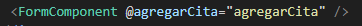
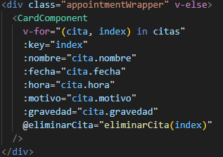
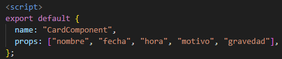
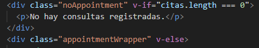
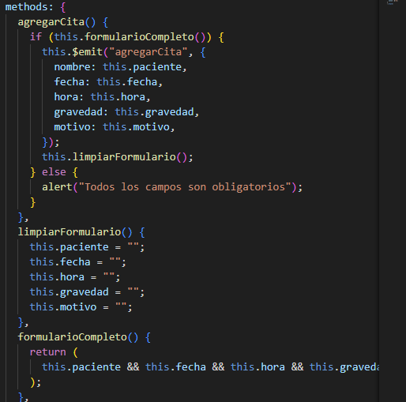
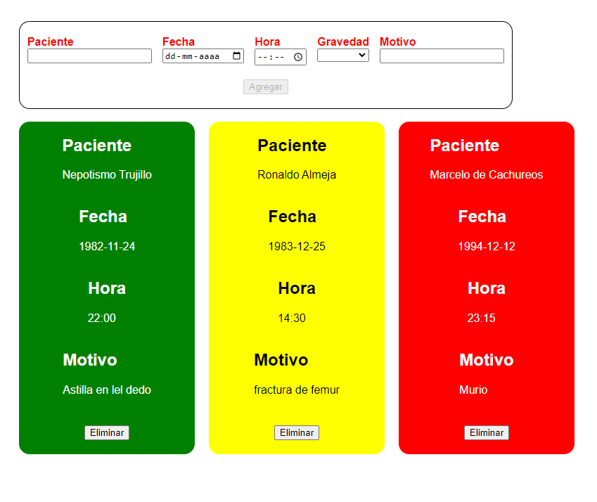

- [Desafío Manejo de Eventos y Reutilizacion de Componentes](#desafío-manejo-de-eventos-y-reutilizacion-de-componentes)
  - [Requerimientos](#requerimientos)
  - [Pasos](#pasos)
  - [Resultado](#resultado)

# Desafío Manejo de Eventos y Reutilizacion de Componentes

- Descripción

En este desafío crearemos un pequeño administrador de citas médicas.
Los labels del formulario deberán estar de color rojo mientras que su input correspondiente esté vacío, de lo contrario deberán retornar su color natural.

  ---

## Requerimientos

1. Utilizar los eventos y las modificadores para agregar interacciones en la aplicación.
   
2. Reutilizar componentes para el ahorro de tiempo en el desarrollo de una aplicación.

3. Hacer uso de las props para el paso de datos a componentes hijos.

4. Cambiar los estilos de elementos a partir de eventos emitidos por el usuario.

5. Comunicar componentes hijos con su padre a través de la emisión de eventos.

   ---

## Pasos

1. Se Utilizan eventos y modificadores para agregar interacciones en la aplicación.

2. Se Reutilizan componentes para mayor rendimiento en la aplicacion.

3. Hacemos uso de las props para el paso de datos a componentes hijos

4. Cambiamos los estilos de elementos a partir de eventos emitidos por el usuario.

5. Comunicamos componentes hijos con su padre a través de la emisión de eventos.

---

## Resultado

